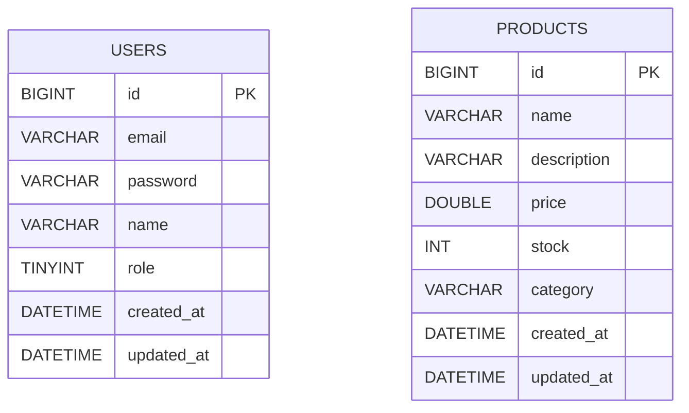

# Phase 1 기획 및 설계: ERD와 User/Product 도메인

## 개요
Phase 1에서 구현할 User, Product 두 도메인의 ERD와 엔티티 설계를 정리한다. 인증(JWT), API 응답 포맷, Swagger 등 계층 설계는 이후 단계에서 별도로 다룬다. 이 시점에는 두 도메인 사이에 직접적인 연관관계를 두지 않는다. 주문(Order)이 둘을 연결하는 시점은 Phase 2다.

## ERD

## User 도메인 설계

| 컬럼 | 타입 | 설명 |
|------|------|------|
| id | BIGINT (PK, AUTO_INCREMENT) | |
| email | VARCHAR(255) | 로그인 식별자 |
| password | VARCHAR(255) | 해시된 비밀번호 저장 (해싱 알고리즘은 인증 Step에서 결정) |
| name | VARCHAR(50) | |
| role | TINYINT | `UserRole` Enum, `@Enumerated(EnumType.ORDINAL)`로 매핑 |
| created_at / updated_at | DATETIME | Auditing 적용 |

이메일 중복 여부는 회원가입 API(Step 1.7)에서 `existsByEmail` 조회로 애플리케이션 레벨에서만 검증한다. DB 유니크 인덱스는 이번 Step 범위에서는 걸지 않았다.

## Product 도메인 설계

| 컬럼 | 타입 | 설명 |
|------|------|------|
| id | BIGINT (PK, AUTO_INCREMENT) | |
| name | VARCHAR(200) | |
| description | VARCHAR(1000) | |
| price | DOUBLE | |
| stock | INT | |
| category | VARCHAR(50) | 별도 테이블 없이 문자열로 저장 |
| created_at / updated_at | DATETIME | Auditing 적용 |

Rich Domain 원칙에 따라 재고 증감은 setter 대신 `increaseStock` / `decreaseStock` 도메인 메서드로 캡슐화한다. 두 메서드 모두 파라미터와 현재 재고값에 대한 단순 조건문 수준의 검증만 수행하며, 동시성 방어(락, 원자적 UPDATE 등)는 Step 1.8 범위에서 의도적으로 적용하지 않는다.

## 설계 시 남겨둔 논의 지점

- `price`를 `DOUBLE`로 잡았다. 금액 계산에 부동소수점 오차가 발생할 수 있는 타입인데, 이 트레이드오프를 감수할 것인지 `BigDecimal` / `DECIMAL`로 바꿀 것인지 결정이 필요하다.
- `role`을 `EnumType.ORDINAL`로 매핑했다. Enum 순서가 바뀌면 저장된 데이터의 의미가 깨지는 매핑 방식이다.
- 이메일 유일성을 애플리케이션 레벨 조회에만 의존하고 있다. 동시 요청 시 이 검증만으로 유일성이 보장되는지 짚어볼 필요가 있다.
- `category`를 문자열 컬럼으로 뒀다. 카테고리 계층 구조나 카테고리별 속성이 필요해지는 시점에 정규화 여부를 재검토한다.
