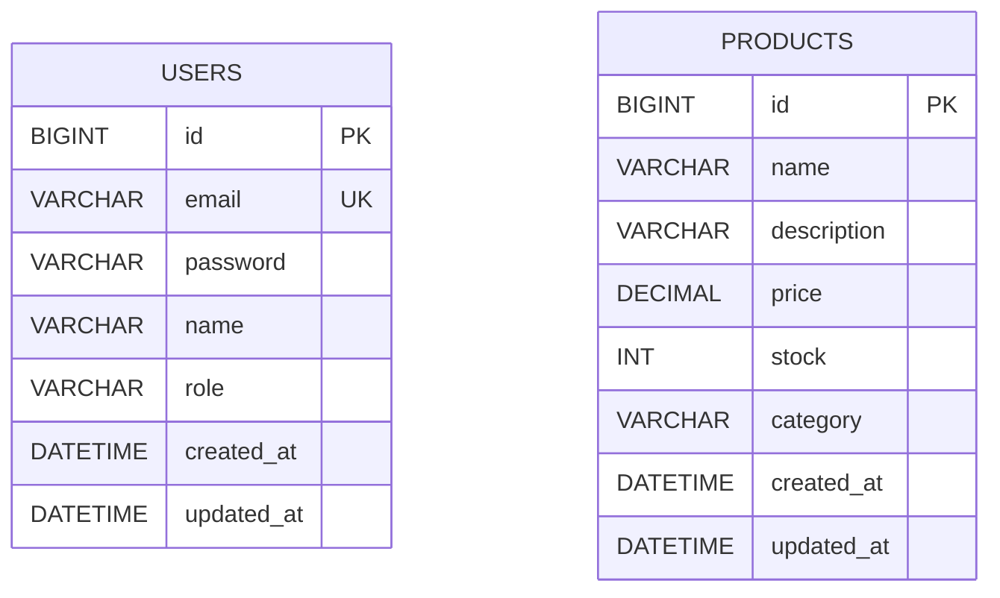

# Phase 1 기획 및 설계: ERD와 User/Product 도메인

## 개요
Phase 1에서 구현할 User, Product 두 도메인의 ERD와 엔티티 설계를 정리한다. 인증(JWT), API 응답 포맷, Swagger 등 계층 설계는 이후 별도 문서에서 다룬다. 이 시점에는 두 도메인 사이에 직접적인 연관관계를 두지 않는다. 주문(Order)이 둘을 연결하는 시점은 Phase 2다.

## ERD

## User 도메인 설계

| 컬럼 | 타입 | 설명 |
|------|------|------|
| id | BIGINT (PK, AUTO_INCREMENT) | |
| email | VARCHAR(255), UNIQUE | 로그인 식별자 |
| password | VARCHAR(255) | 해시된 비밀번호 저장 (해싱 알고리즘은 인증 설계에서 결정) |
| name | VARCHAR(50) | |
| role | VARCHAR(20) | `UserRole` Enum, `@Enumerated(EnumType.STRING)`로 매핑 |
| created_at / updated_at | DATETIME | Auditing 적용 |

`role`은 `EnumType.ORDINAL` 대신 `STRING`으로 매핑한다. `ORDINAL`은 Enum 상수 선언 순서를 그대로 저장하므로, 나중에 상수 순서가 바뀌거나 중간에 값이 추가되면 이미 저장된 데이터의 의미가 깨진다. 컬럼 크기가 조금 늘어나는 대신 데이터 정합성을 우선했다.

이메일 유일성은 DB 레벨 `UNIQUE` 제약으로 보장한다. 회원가입 API의 `existsByEmail` 조회는 UX 상 빠른 실패 응답을 위한 선제 검증이며, 동시 요청에 대한 최종 방어는 DB 제약과 유니크 제약 위반 예외 처리에 위임한다.

## Product 도메인 설계

| 컬럼 | 타입 | 설명 |
|------|------|------|
| id | BIGINT (PK, AUTO_INCREMENT) | |
| name | VARCHAR(200) | |
| description | VARCHAR(1000) | |
| price | DECIMAL(10,2) | |
| stock | INT | |
| category | VARCHAR(50) | 별도 테이블 없이 문자열로 저장 |
| created_at / updated_at | DATETIME | Auditing 적용 |

`price`는 `DOUBLE`이 아닌 `DECIMAL(10,2)`(자바 타입은 `BigDecimal`)로 잡는다. `DOUBLE`은 이진 부동소수점이라 십진 금액을 정확히 표현하지 못해 누적 연산에서 오차가 생길 수 있는 반면, `DECIMAL`/`BigDecimal`은 십진 기반이라 금액 계산에 오차가 없다.

`category`는 지금 단계에서는 별도 테이블 없이 문자열 컬럼으로 유지한다. 카테고리 계층 구조나 카테고리별 속성처럼 문자열만으로 표현하기 어려운 요구사항이 생기면 그때 별도 `Category` 엔티티로 분리한다.

Rich Domain 원칙에 따라 재고 증감은 setter 대신 `increaseStock` / `decreaseStock` 도메인 메서드로 캡슐화해 재고가 음수가 되는 상태를 엔티티 스스로 막는다. 두 메서드 모두 단일 트랜잭션 내 값 검증만 수행하며, 동시 요청 간 경쟁 조건에 대한 락이나 원자적 UPDATE 방어는 포함하지 않는다.
