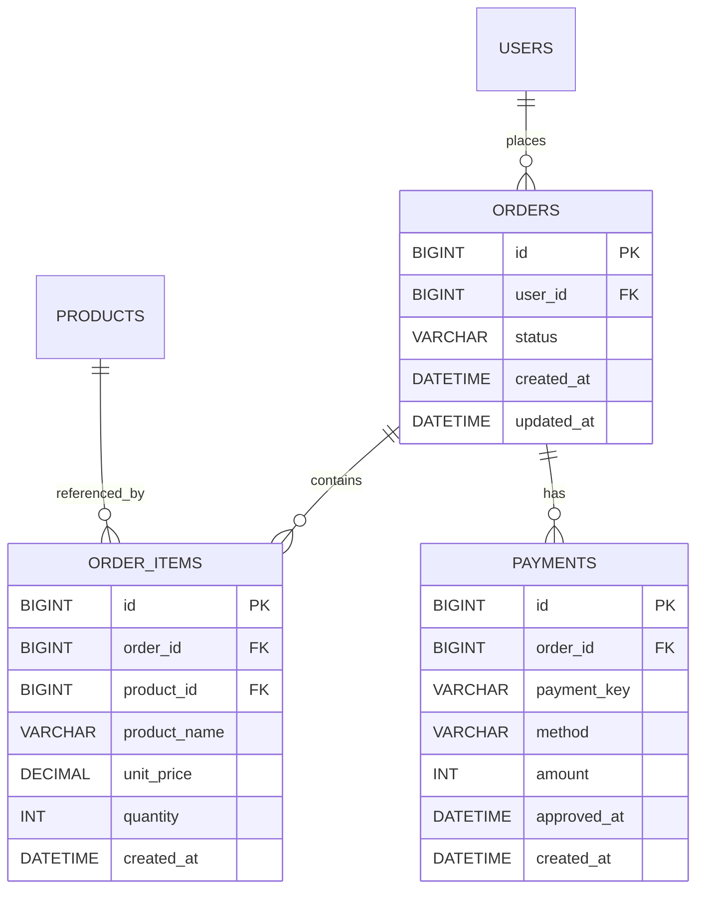
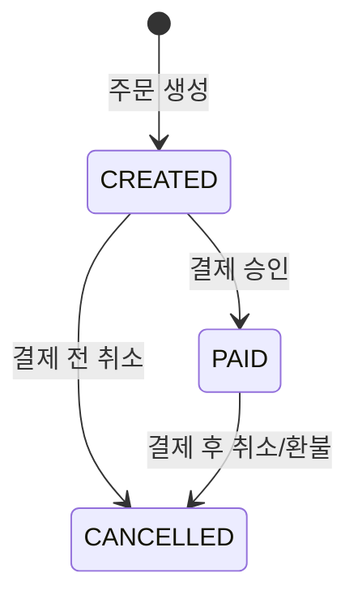

# Order 도메인 설계와 Toss 결제 연동 흐름

## 개요
Order, OrderItem, Payment 세 도메인의 ERD와 주문 상태 설계, Toss Payments 연동 흐름을 정리한다. 인증된 사용자만 주문을 생성할 수 있다고 가정한다. 결제 완료 이후의 비동기 알림/이벤트 처리는 결제 흐름 자체가 확정된 다음 별도 문서에서 다룬다.

## ERD

## Order 도메인 설계

| 컬럼 | 타입 | 설명 |
|------|------|------|
| id | BIGINT (PK, AUTO_INCREMENT) | |
| user_id | BIGINT (FK → users.id) | 주문을 생성한 사용자 |
| status | VARCHAR(20) | 주문 상태, `OrderStatus` Enum을 `EnumType.STRING`으로 매핑 |
| created_at / updated_at | DATETIME | Auditing 적용 |

### 상태 설계

`OrderStatus`는 `CREATED`(주문 생성, 결제 대기) / `PAID`(결제 승인 완료) / `CANCELLED`(취소 또는 환불) 세 값으로 정의한다. 상태를 바꾸는 통로는 `Order` 엔티티의 도메인 메서드(`pay()`, `cancel()`)로만 열어두고, 필드를 직접 바꾸는 setter는 두지 않는다. 각 메서드는 호출 시점에 현재 상태가 다이어그램에서 허용하는 출발 상태인지 먼저 확인하고, 아니면 예외를 던진다 — 예를 들어 `cancel()`은 현재 상태가 `CREATED` 또는 `PAID`일 때만 허용하고, 이미 `CANCELLED`인 주문에 다시 호출되면 실패한다. `Product.decreaseStock()`이 재고 불변식을 엔티티 메서드 안에서 검증했던 것과 같은 이유로, 상태 전이 검증도 서비스 계층이 아니라 `Order` 엔티티 스스로 책임진다 — 상태를 바꿀 수 있는 진입점을 엔티티 메서드 하나로 좁혀두면, 서비스 코드가 여러 곳에서 제각각 상태를 바꾸더라도 불변식이 항상 지켜진다.

## OrderItem 도메인 설계

| 컬럼 | 타입 | 설명 |
|------|------|------|
| id | BIGINT (PK, AUTO_INCREMENT) | |
| order_id | BIGINT (FK → orders.id) | |
| product_id | BIGINT (FK → products.id) | 원본 상품 참조(이력 조회용, 가격/이름 계산에는 쓰지 않음) |
| product_name | VARCHAR(200) | 주문 생성 시점의 상품명 스냅샷 |
| unit_price | DECIMAL(10,2) | 주문 생성 시점의 단가 스냅샷 |
| quantity | INT | 주문 수량 |
| created_at | DATETIME | |

`Product`를 살아있는 참조로만 갖고 있으면, 이후 상품 가격이 바뀔 때 이미 완료된 과거 주문의 조회 결과까지 함께 바뀌어 보인다 — 10,000원에 구매한 주문을 나중에 다시 열어봤을 때, 그사이 상품 가격이 12,000원으로 인상됐다면 과거 주문 내역도 12,000원으로 표시되는 식이다. 주문은 "그 시점에 실제로 지불한 금액"을 보존해야 하므로, `product_name`과 `unit_price`를 주문 생성 시점 값으로 스냅샷해서 `OrderItem`에 함께 저장한다. `product_id`는 남겨두되 금액/이름 계산에는 쓰지 않고, 원본 상품으로 이동하는 참조 용도로만 둔다.

`product_name`과 `unit_price`는 각각의 컬럼으로 나열하기보다, 엔티티 구현 단계에서 두 값을 하나의 불변 값 객체(예: 주문 시점 스냅샷을 표현하는 VO)로 묶는 것을 검토한다. 두 값은 "주문 시점에 함께 확정되고 이후 절대 개별적으로 바뀌지 않는다"는 하나의 개념을 이루므로, 별개 필드보다 하나의 값 객체로 다루는 쪽이 불변성을 코드로 더 명확히 드러낸다.

## Payment 도메인 설계

| 컬럼 | 타입 | 설명 |
|------|------|------|
| id | BIGINT (PK, AUTO_INCREMENT) | |
| order_id | BIGINT (FK → orders.id) | 결제가 이루어진 주문 |
| payment_key | VARCHAR(200) | Toss가 발급한 PG 거래 고유 식별자 |
| method | VARCHAR(50) | 결제수단(카드, 계좌이체 등), Toss 승인 응답 기준 |
| amount | INT | Toss가 실제로 승인한 금액 |
| approved_at | DATETIME | Toss 승인 시각 |
| created_at | DATETIME | Payment 레코드 저장 시각 |

`Order`는 "무엇을 얼마에 주문했는가"를 표현하고, `Payment`는 "그 대금을 실제로 어떻게 지불받았는가"를 표현한다. 지금까지는 `orders.status`가 `PAID`로 바뀌는 것만으로 결제 완료를 표현해왔는데, 이 값만으로는 PG사가 실제로 어떤 수단으로 얼마를 언제 승인했는지 알 수 없다. 영수증 조회, 정산, 환불 같은 후속 처리는 모두 "그 결제 건 자체"에 대한 정보가 필요하므로, `Order`의 상태 필드가 아니라 별도 엔티티로 분리해서 저장한다.

`payment_key`는 Toss 승인 API 호출 시 서버가 이미 보유하고 있는 값(클라이언트가 결제창에서 넘겨준 값)이지만, 승인 응답이 성공한 뒤 Toss가 실제로 확인해 준 `method`, `amount`, `approved_at`은 응답 바디에서 가져온 값을 그대로 저장한다. 클라이언트가 요청에 실어 보낸 금액이 아니라 Toss가 승인 응답으로 돌려준 금액을 저장해야, "우리가 승인을 요청한 금액"과 "PG사가 실제로 승인한 금액"이 다른 경우에도 이 테이블이 실제 승인 결과를 정확히 반영한다.

## Toss Payments 연동 흐름

1. 클라이언트가 주문 생성 API를 호출한다. 서버는 `Order`를 `CREATED` 상태로 만들고 주문 식별자를 발급한다.
2. 클라이언트가 Toss SDK로 결제창을 띄운다. 이때 주문 식별자, 결제 금액, 주문명을 함께 전달한다.
3. 사용자가 결제를 완료하면 Toss가 설정된 성공 URL로 리다이렉트하면서 `paymentKey`, 주문 식별자, 결제 금액을 함께 넘겨준다.
4. 클라이언트가 이 값들을 그대로 서버의 결제 승인 API로 전달한다.
5. 서버는 전달받은 `paymentKey`, 주문 식별자, 금액으로 Toss 결제 승인 API(`POST /v1/payments/confirm`)를 호출한다.
6. 승인 API 응답이 성공이면 서버는 `Order` 상태를 `PAID`로 변경하고, 응답 바디에 담긴 `paymentKey`/결제수단/승인금액/승인시각으로 `Payment` 레코드를 생성한다. 실패하면 `Order`는 `CANCELLED`로 변경하고 `Payment`는 생성하지 않는다.

Toss는 결제 승인 API 응답과는 별도로 웹훅을 통해서도 결제 상태를 통지할 수 있다. 어느 경로로 결제 완료를 통지받든 `Order` 상태 전이와 `Payment` 레코드 생성은 함께 이루어져야 한다. 이 설계에서는 승인 API 응답 경로를 기준으로 흐름을 정리하며, 웹훅 경로와 두 경로가 동시에 들어올 때의 정합성 문제는 다루지 않는다.

결제 승인 응답으로 `Order.pay()`가 호출되는 시점과, 같은 주문에 대해 사용자가 `Order.cancel()`을 동시에 요청하는 시점이 겹치는 경쟁 조건도 이 설계에서는 다루지 않는다. 상태 전이 가드는 순차적으로 호출됐을 때 잘못된 전이를 막아주지만, 두 요청이 동시에 같은 `Order` 행을 읽고 쓰는 상황에서 최종 상태가 무엇이 되는지는 별도의 락 전략(비관적 락/낙관적 락/분산 락) 선택이 필요한 문제라, 이 문서에서는 다루지 않는다.

## 패키지 구조 방향

현재 코드베이스는 `domain/user`, `domain/product`처럼 도메인 하나당 패키지 하나에 컨트롤러·서비스·엔티티·레포지토리·DTO를 모두 평평하게 두는 구조다. 도메인이 두 개일 때는 이 구조로 충분했지만, `Order`가 `User`/`Product`를 참조하고 다시 결제·알림 도메인이 `Order`를 참조하는 식으로 도메인 간 의존이 늘어나면, 어떤 계층이 어떤 계층에 의존해도 되는지를 패키지 구조가 강제하지 못한다는 문제가 드러난다. 예를 들어 컨트롤러가 다른 도메인의 레포지토리를 직접 참조하는 것을 막을 장치가 지금은 없다.

인프라 확장을 앞둔 시점에 도메인 패키지 내부를 표현 계층(컨트롤러)·응용 계층(서비스/파사드)·도메인 계층(엔티티·값 객체)으로 명시적으로 구분하는 Lite DDD 스타일로 재정비한다. 구체적인 패키지 경계와 이동 대상 클래스는 도메인 수가 늘어난 뒤 실제 의존 관계를 보고 정한다.
