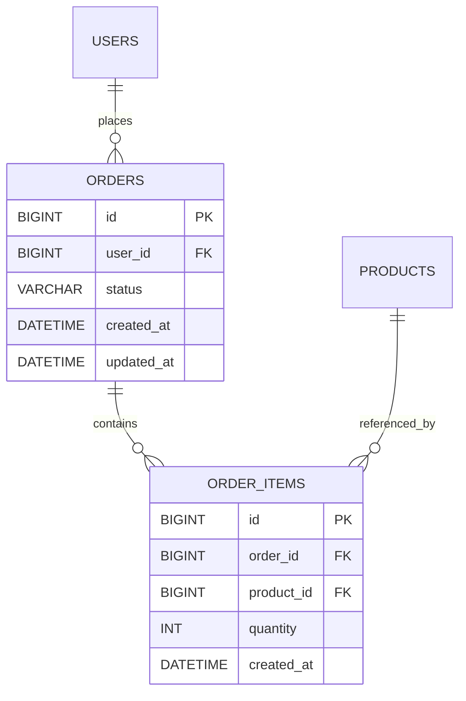
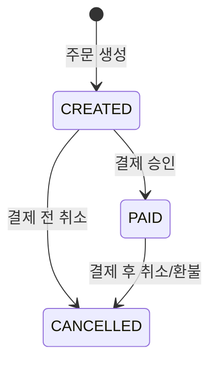

# Order 도메인 설계와 Toss 결제 연동 흐름

## 개요
Order, OrderItem 두 도메인의 ERD와 주문 상태 설계, Toss Payments 연동 흐름을 정리한다. 인증된 사용자만 주문을 생성할 수 있다고 가정한다. 결제 완료 이후의 비동기 알림/이벤트 처리는 결제 흐름 자체가 확정된 다음 별도 문서에서 다룬다.

## ERD

## Order 도메인 설계

| 컬럼 | 타입 | 설명 |
|------|------|------|
| id | BIGINT (PK, AUTO_INCREMENT) | |
| user_id | BIGINT (FK → users.id) | 주문을 생성한 사용자 |
| status | VARCHAR(20) | 주문 상태, `OrderStatus` Enum을 `EnumType.STRING`으로 매핑 |
| created_at / updated_at | DATETIME | Auditing 적용 |

### 상태 설계

`OrderStatus`는 `CREATED`(주문 생성, 결제 대기) / `PAID`(결제 승인 완료) / `CANCELLED`(취소 또는 환불) 세 값으로 정의한다. 상태값 자체는 Enum으로 관리해 임의의 문자열이 들어가는 것은 막지만, 다이어그램에 그려진 화살표(허용된 전이) 외의 전이 — 예를 들어 `CANCELLED`에서 다시 `PAID`로 되돌리는 것 — 를 막는 검증은 이 설계 시점에서는 별도로 정의하지 않는다. `Order` 엔티티는 상태를 바꾸는 지점마다 "지금 상태에서 이 상태로 갈 수 있는가"를 확인하기보다, 호출하는 쪽이 올바른 순서로 호출한다고 가정하는 형태로 둔다.

## OrderItem 도메인 설계

| 컬럼 | 타입 | 설명 |
|------|------|------|
| id | BIGINT (PK, AUTO_INCREMENT) | |
| order_id | BIGINT (FK → orders.id) | |
| product_id | BIGINT (FK → products.id) | |
| quantity | INT | 주문 수량 |
| created_at | DATETIME | |

주문 시점의 상품 가격과 이름은 별도로 저장하지 않는다. 주문 상세 화면이나 영수증에 표시할 금액이 필요하면 `product_id`로 `Product`를 조회해서 현재 `price`를 가져와 `quantity`를 곱해 계산한다. 상품명도 같은 방식으로 `Product.name`을 그대로 참조한다.

## Toss Payments 연동 흐름

1. 클라이언트가 주문 생성 API를 호출한다. 서버는 `Order`를 `CREATED` 상태로 만들고 주문 식별자를 발급한다.
2. 클라이언트가 Toss SDK로 결제창을 띄운다. 이때 주문 식별자, 결제 금액, 주문명을 함께 전달한다.
3. 사용자가 결제를 완료하면 Toss가 설정된 성공 URL로 리다이렉트하면서 `paymentKey`, 주문 식별자, 결제 금액을 함께 넘겨준다.
4. 클라이언트가 이 값들을 그대로 서버의 결제 승인 API로 전달한다.
5. 서버는 전달받은 `paymentKey`, 주문 식별자, 금액으로 Toss 결제 승인 API(`POST /v1/payments/confirm`)를 호출한다.
6. 승인 API 응답이 성공이면 서버는 `Order` 상태를 `PAID`로 변경한다. 실패하면 `CANCELLED`로 변경한다.

Toss는 결제 승인 API 응답과는 별도로 웹훅을 통해서도 결제 상태를 통지할 수 있다. 이 설계에서는 승인 API 응답 경로만 다루며, 웹훅 수신 처리와 두 경로가 동시에 들어올 때의 정합성 문제는 다루지 않는다.

## 패키지 구조 방향

현재 코드베이스는 `domain/user`, `domain/product`처럼 도메인 하나당 패키지 하나에 컨트롤러·서비스·엔티티·레포지토리·DTO를 모두 평평하게 두는 구조다. 도메인이 두 개일 때는 이 구조로 충분했지만, `Order`가 `User`/`Product`를 참조하고 다시 결제·알림 도메인이 `Order`를 참조하는 식으로 도메인 간 의존이 늘어나면, 어떤 계층이 어떤 계층에 의존해도 되는지를 패키지 구조가 강제하지 못한다는 문제가 드러난다. 예를 들어 컨트롤러가 다른 도메인의 레포지토리를 직접 참조하는 것을 막을 장치가 지금은 없다.

인프라 확장을 앞둔 시점에 도메인 패키지 내부를 표현 계층(컨트롤러)·응용 계층(서비스/파사드)·도메인 계층(엔티티·값 객체)으로 명시적으로 구분하는 Lite DDD 스타일로 재정비한다. 구체적인 패키지 경계와 이동 대상 클래스는 도메인 수가 늘어난 뒤 실제 의존 관계를 보고 정한다.
