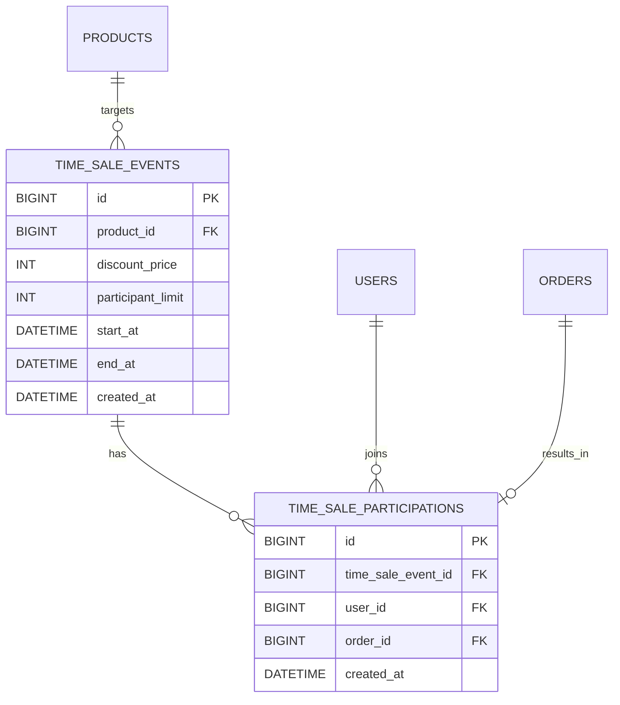
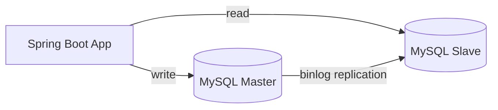

# 타임세일 도메인 설계와 Master-Slave 인프라 확장 전략

## 개요
선착순 100명 한정 타임세일 이벤트 도메인의 ERD와 참여 제한 로직, 그리고 트래픽 증가에 대응하기 위한 MySQL Master-Slave 복제 구성과 Read/Write 라우팅 전략을 정리한다. 타임세일 대상 상품은 기존 `Product` 중 하나를 지정하는 방식으로 설계하고, 결제 이후의 비동기 메시징/이벤트 발행 방식은 이 문서에서 다루지 않는다.

## ERD

## TimeSaleEvent 도메인 설계

| 컬럼 | 타입 | 설명 |
|------|------|------|
| id | BIGINT (PK, AUTO_INCREMENT) | |
| product_id | BIGINT (FK → products.id) | 타임세일 대상 상품 |
| discount_price | INT | 타임세일 적용가(정가보다 낮은 값) |
| participant_limit | INT | 선착순 참여 가능 인원, 100 고정 |
| start_at / end_at | DATETIME | 이벤트 시작/종료 시각 |
| created_at | DATETIME | |

## TimeSaleParticipation 도메인 설계

| 컬럼 | 타입 | 설명 |
|------|------|------|
| id | BIGINT (PK, AUTO_INCREMENT) | |
| time_sale_event_id | BIGINT (FK → time_sale_events.id) | |
| user_id | BIGINT (FK → users.id) | |
| order_id | BIGINT (FK → orders.id) | 참여 성공 시 함께 생성되는 주문 |
| created_at | DATETIME | |

`(time_sale_event_id, user_id)` 조합에 유니크 제약을 걸어, 같은 사용자가 같은 이벤트에 두 번 참여해 슬롯을 중복으로 차지하는 것은 막는다.

## 선착순 100명 참여 제한 로직

참여 가능 인원은 이벤트당 100명으로 고정한다. 사용자가 "참여하기"를 요청하면 서비스 계층에서 다음 순서로 처리한다.

1. `TimeSaleParticipationRepository.countByTimeSaleEventId(eventId)`로 현재까지의 참여자 수를 조회한다.
2. 조회된 수가 `participant_limit`(100) 미만이면 `Order`를 생성하고 `TimeSaleParticipation` 레코드를 저장한다.
3. 100 이상이면 참여를 거부하는 예외를 반환한다.

이 카운트 조회와 저장은 하나의 `@Transactional` 메서드 안에서 순서대로 실행되므로, 101번째 참여 요청부터는 카운트가 100 이상으로 확인되어 정상적으로 거부된다. `Product.decreaseStock()`이 저장 시점에 재고를 검증하는 것과 같은 방식으로, 참여자 수도 저장 시점에 매번 다시 세어 확인하기 때문에 초과 참여는 발생하지 않는다.

## Master-Slave 복제 구성과 Read/Write 라우팅

타임세일 시작 직후 짧은 시간에 상품/이벤트 조회 트래픽이 집중되므로, 조회 트래픽을 Master에서 분리한다. `AbstractRoutingDataSource`를 이용해 트랜잭션의 읽기 전용 여부(`@Transactional(readOnly = true)`)를 기준으로 라우팅 대상을 결정한다.

- 쓰기 트랜잭션(`@Transactional`) → Master로 라우팅
- 읽기 전용 트랜잭션(`@Transactional(readOnly = true)`) → Slave로 라우팅

이벤트 목록/상세 조회, 상품 목록 조회처럼 트래픽이 집중되는 API는 모두 `readOnly = true`로 선언되어 있으므로, 이 규칙 하나로 조회 트래픽 전체가 Slave로 분산된다.

## 이 문서에서 다루지 않는 범위

- 참여/주문 생성 이후 결제 완료 이벤트를 메시지 큐로 안정적으로 발행하는 방식(Outbox 패턴)은 별도 설계에서 다룬다.
- Redis 분산 락 등 애플리케이션 레벨 동시성 제어 구현 세부사항은 실제 부하 재현 이후 별도로 다룬다.
