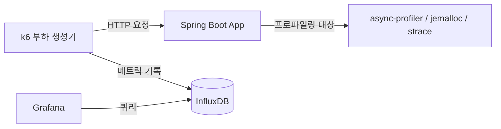

# 부하 테스트 자동화와 실행 환경 프로파일링 설계

## 개요
지금까지 구현한 타임세일 참여 동시성 제어 전략 — 락 없음(경쟁 조건 노출), 낙관적 락 단독, 낙관적 락 + 재시도, Redis 분산 락(Redisson), Redis 원자 연산 + 비동기 아웃박스 — 을 동일한 부하 조건에서 정량적으로 비교하기 위한 k6 부하 테스트 자동화 파이프라인을 정리한다. 아울러 장시간 운영 중 드러나는 메모리 누수와 CPU 스파이크를 진단하기 위한 프로파일링 도구 구성도 함께 다룬다. 실제 측정 수치, 대시보드 캡처, 트러블슈팅 결과는 이 문서에서 다루지 않는다.

## 부하 테스트 모니터링 스택

`docker-compose`에 k6, InfluxDB, Grafana 컨테이너를 추가하고, k6 실행 결과를 InfluxDB에 적재해 Grafana 대시보드로 시각화한다. App 컨테이너에는 `cap_add: - SYS_PTRACE` 권한을 부여해, 이후 async-profiler와 strace가 컨테이너 내부 프로세스의 스택/시스템 콜을 추적할 수 있게 한다.

## 비교 대상 다섯 가지 참여 전략

| 전략 | 핵심 동작 | 예상 특징 |
|------|-----------|-----------|
| 락 없음 | 잔여 수량 확인 후 별도 트랜잭션에서 차감 | 경쟁 조건으로 정원 초과 참여 발생 |
| 낙관적 락 단독 | `@Version` 충돌 시 예외로 즉시 실패 | 충돌률이 높아질수록 성공률 급감 |
| 낙관적 락 + 재시도 | 충돌 시 `@Retryable`로 자동 재시도 | 재시도 소진 시 정원이 남아 있어도 실패 |
| Redis 분산 락(Redisson) | `RLock`으로 DB 트랜잭션 구간을 직렬화 | 대기 타임아웃으로 인한 거부 발생 |
| Redis 원자 연산 + 비동기 아웃박스 | Lua 스크립트로 즉시 확정, DB 반영은 아웃박스로 비동기 처리 | 락 대기 없이 응답, DB는 병목에서 제외 |

각 전략은 실제 구현 히스토리에 그대로 존재하므로, k6 스크립트는 동일한 시나리오(동시 참여 인원, 이벤트당 정원)를 다섯 전략에 대해 각각 실행해 TPS·지연시간·에러율을 비교한다.

## 측정 지표

| 지표 | 설명 |
|------|------|
| TPS | 초당 처리된 참여 요청 수 |
| 지연시간 | 요청별 응답 시간의 min/avg/p95/max |
| 에러율 | 4xx/5xx 응답 비율 |
| 정합성 | 실제 참여 성공 건수가 이벤트 정원을 초과하지 않는지 여부 |

## 부하 테스트 실행 방법

같은 애플리케이션 인스턴스를 재시작하지 않고 다섯 전략을 순서대로 이어서 측정한다. k6 스크립트는 전략별로 지정된 시간(예: 60초) 동안 목표 동시 사용자 수를 유지하며 요청을 보내고, 스크립트 실행 시작부터 종료까지 전체 구간의 평균값을 해당 전략의 TPS·지연시간으로 기록한다.

## 메모리/CPU 프로파일링 도구 구성

| 도구 | 용도 |
|------|------|
| jemalloc | Native Memory 할당 추적, 힙 외 영역의 메모리 증가 확인 |
| async-profiler | CPU/락 프로파일링, 플레임 그래프 생성 |
| strace | 시스템 콜 추적, 파일 디스크립터(FD) 생성/해제 확인 |
| `lsof -p <pid> \| wc -l` | 프로세스가 열고 있는 FD 개수 카운트 |

## SSE 연결 종료와 FD 누수 재현 계획

타임세일 카운트다운 화면은 SSE(Server-Sent Events)로 잔여 시간을 실시간 전송한다. FD 누수 재현은 브라우저 탭을 닫아 SSE 연결을 종료시키는 시나리오로 진행하고, 연결 종료 전후의 `lsof` FD 개수 변화를 비교해 누수 여부를 판단한다.

## 이 문서에서 다루지 않는 범위
- 실제 k6 실행 결과와 전략별 벤치마크 수치는 각 트러블슈팅 문서에서 별도로 다룬다.
- async-profiler 플레임 그래프 해석과 CPU 스파이크의 근본 원인은 별도 트러블슈팅에서 다룬다.
- FD 누수의 근본 원인 분석과 타임아웃/Keep-Alive 튜닝 값은 별도 트러블슈팅에서 다룬다.
