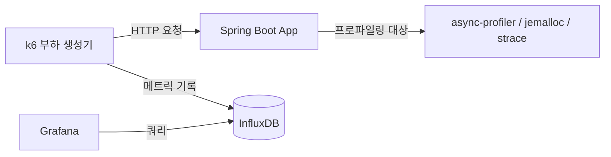

# 부하 테스트 자동화와 실행 환경 프로파일링 설계

## 개요
지금까지 구현한 타임세일 참여 동시성 제어 전략 — 락 없음(경쟁 조건 노출), 낙관적 락 단독, 낙관적 락 + 재시도, Redis 분산 락(Redisson), Redis 원자 연산 + 비동기 아웃박스 — 을 동일한 부하 조건에서 정량적으로 비교하기 위한 k6 부하 테스트 자동화 파이프라인을 정리한다. 아울러 장시간 운영 중 드러나는 메모리 누수와 CPU 스파이크를 진단하기 위한 프로파일링 도구 구성도 함께 다룬다. 실제 측정 수치, 대시보드 캡처, 트러블슈팅 결과는 이 문서에서 다루지 않는다.

## 부하 테스트 모니터링 스택

`docker-compose`에 k6, InfluxDB, Grafana 컨테이너를 추가하고, k6 실행 결과를 InfluxDB에 적재해 Grafana 대시보드로 시각화한다. App 컨테이너에는 `cap_add: - SYS_PTRACE` 권한을 부여해, 이후 async-profiler와 strace가 컨테이너 내부 프로세스의 스택/시스템 콜을 추적할 수 있게 한다.

## 비교 대상 다섯 가지 참여 전략

| 전략 | 핵심 동작 | 예상 특징 |
|------|-----------|-----------|
| 락 없음 | 잔여 수량 확인 후 별도 트랜잭션에서 차감 | 경쟁 조건으로 정원 초과 참여 발생 |
| 낙관적 락 단독 | `@Version` 충돌 시 예외로 즉시 실패 | 충돌률이 높아질수록 성공률 급감 |
| 낙관적 락 + 재시도 | 충돌 시 `@Retryable`로 자동 재시도 | 재시도 소진 시 정원이 남아 있어도 실패 |
| Redis 분산 락(Redisson) | `RLock`으로 DB 트랜잭션 구간을 직렬화 | 대기 타임아웃으로 인한 거부 발생 |
| Redis 원자 연산 + 비동기 아웃박스 | Lua 스크립트로 즉시 확정, DB 반영은 아웃박스로 비동기 처리 | 락 대기 없이 응답, DB는 병목에서 제외 |

폐기된 네 전략은 지금 애플리케이션에 남아 있지 않으므로, k6가 실제로 때릴 수 있는 형태로 되살려야 한다. git 히스토리를 되돌려 과거 시점 전체를 재기동하는 방식은 그 시점 이후 추가된 다른 기능(비동기 아웃박스 처리 등)까지 함께 사라져 "참여 로직만 다르고 나머지 조건은 동일한" 비교가 불가능해지므로 배제한다. 대신 각 폐기 전략을 벤치마크 전용 컨트롤러/서비스로 재구현해 `/benchmark/participate/{strategy}` 형태의 별도 엔드포인트로 노출하고, 이벤트·상품·유저 등 나머지 인프라는 최신 코드를 그대로 공유한다. k6는 동일한 시나리오(동시 참여 인원, 이벤트당 정원)로 이 엔드포인트들을 전략별로 타겟팅해 TPS·지연시간·에러율을 비교한다. 이 벤치마크 전용 코드는 프로덕션 참여 경로(`/api/time-sales/{id}/participate`)와 분리하고, 성능 비교가 끝나면 프로덕션 배포 대상에서 제외한다.

## 측정 지표

| 지표 | 설명 |
|------|------|
| TPS | 초당 처리된 참여 요청 수 |
| 지연시간 | 요청별 응답 시간의 min/avg/p95/max |
| 에러율 | 4xx/5xx 응답 비율 |
| 정합성 | 실제 참여 성공 건수가 이벤트 정원을 초과하지 않는지 여부 |

## 부하 테스트 실행 방법

k6 스크립트는 전략별로 지정된 시간(예: 60초) 동안 목표 동시 사용자 수를 유지하며 요청을 보내고, 스크립트 실행 시작부터 종료까지 전체 구간의 평균값을 해당 전략의 TPS·지연시간으로 기록한다.

> [!IMPORTANT]
> JVM은 같은 메서드가 일정 횟수 이상 호출되어야 JIT 컴파일러(C1/C2)가 그 메서드를 네이티브 코드로 컴파일해 실행 속도가 붙는다. 다섯 전략을 같은 애플리케이션 인스턴스에서 재시작 없이 이어서 측정하면, 여러 전략이 공유하는 하부 경로(Repository 조회, 엔티티 매핑 등)가 앞선 전략을 실행하는 동안 이미 컴파일되어, 뒤에 측정되는 전략일수록 유리한 조건에서 측정된다. 전략 간 성능을 공정하게 비교하려면 시나리오마다 애플리케이션을 재시작하고, 측정 전 동일한 더미 부하로 워밍업해 JIT 컴파일 상태를 통일해야 한다.
>
> 이 워밍업은 전략 비교 목적의 벤치마크에만 적용한다. 콜드 스타트 자체에서 발생하는 CPU 스파이크·TPS 하락을 재현하는 시나리오에서는 반대로 워밍업 없는 상태를 그대로 보존해야 재현하려는 현상이 실제로 나타난다.

## 메모리/CPU 프로파일링 도구 구성

| 도구 | 용도 |
|------|------|
| jemalloc | Native Memory 할당 추적, 힙 외 영역의 메모리 증가 확인 |
| async-profiler | CPU/락 프로파일링, 플레임 그래프 생성 |
| strace | 시스템 콜 추적, 파일 디스크립터(FD) 생성/해제 확인 |
| `lsof -p <pid> \| wc -l` | 프로세스가 열고 있는 FD 개수 카운트 |

## SSE 연결 종료와 FD 누수 재현 계획

타임세일 카운트다운 화면은 SSE(Server-Sent Events)로 잔여 시간을 실시간 전송한다. FD 누수 재현은 두 가지 종료 경로를 모두 시나리오에 넣는다.

- **정상 종료**: 브라우저 탭을 닫아 TCP FIN이 오가는 경로. 서버가 다음 쓰기 시도에서 `IOException`을 즉시 받아 `SseEmitter`가 정리된다.
- **비정상 종료**: 클라이언트 프로세스를 강제 종료하거나 네트워크 연결을 끊어 FIN 없이 연결이 끊기는 경로. 서버는 다음 쓰기 시도 전까지 연결이 끊긴 사실 자체를 알 수 없다.

두 경로는 서버가 연결 종료를 감지하는 신호(FIN 유무)가 다른 별개의 코드 경로이므로, 정상 종료 시나리오만으로 FD가 늘지 않는다는 결과를 확인해도 비정상 종료 경로의 누수 여부는 증명되지 않는다. 각 경로 종료 전후의 `lsof` FD 개수 변화를 따로 비교해 누수 여부를 판단한다.

## 이 문서에서 다루지 않는 범위
- 실제 k6 실행 결과와 전략별 벤치마크 수치는 각 트러블슈팅 문서에서 별도로 다룬다.
- async-profiler 플레임 그래프 해석과 CPU 스파이크의 근본 원인은 별도 트러블슈팅에서 다룬다.
- FD 누수의 근본 원인 분석과 타임아웃/Keep-Alive 튜닝 값은 별도 트러블슈팅에서 다룬다.
